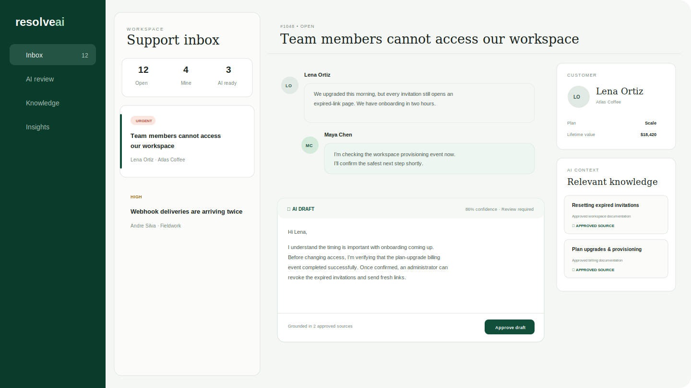
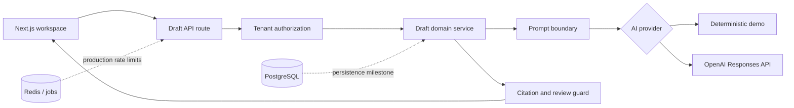

# ResolveAI

ResolveAI is a production-minded support operations workspace that pairs human
judgment with grounded AI assistance. Agents can review customer context,
approved knowledge, and a structured response draft without allowing AI to send
messages or cross tenant boundaries.



## Why this project exists

AI support demos often optimize for a fast response while hiding the difficult
parts: authorization, prompt injection, knowledge provenance, failure handling,
cost control, and human accountability. ResolveAI makes those constraints part
of the product and the architecture.

## Current vertical slice

- Responsive support inbox and conversation workspace
- Tenant authorization before ticket or AI access
- Approved knowledge attached to each ticket
- Deterministic local AI provider for zero-configuration demos
- OpenAI Responses API provider with strict structured output
- Prompt boundary escaping and untrusted-content instructions
- Citation allow-listing and mandatory human review
- Per-actor generation rate limiting
- Health endpoint, tests, CI, and production Docker image

No AI-generated message is sent automatically.

## Architecture



The framework boundary is deliberately thin. Authorization and post-generation
guardrails live in the domain service and are independently testable. See
[`docs/architecture.md`](docs/architecture.md) and the architecture decisions in
[`docs/decisions`](docs/decisions).

## Run locally

Requirements: Node.js 20.9 or newer.

```bash
cp .env.example .env.local
npm install
npm run dev
```

Open `http://localhost:3000`. The app uses a deterministic provider unless
`OPENAI_API_KEY` is set, so the complete review workflow works without external
services or API spend.

To enable the live AI provider:

```bash
OPENAI_API_KEY=your-key
OPENAI_MODEL=gpt-5.6-terra
```

Keep real credentials in environment or secret storage; never commit them.

## Quality checks

```bash
npm run lint
npm run typecheck
npm test
npm run build
```

CI runs the same checks for pushes and pull requests.

## Security model

- Organization identity is resolved before ticket lookup.
- The domain service repeats tenant authorization as defense in depth.
- Customer messages and knowledge are treated as untrusted model input.
- Model output must match a strict schema and is validated again at runtime.
- Citations not present in the approved ticket context are removed and flagged.
- Generated text is always marked for review; this slice has no send endpoint.
- The live provider uses a privacy-preserving safety identifier and disables API
  response storage.

The demo request headers are not production authentication. The next milestone
replaces them with verified session claims. See [`SECURITY.md`](SECURITY.md).

## Roadmap

The repository intentionally distinguishes shipped behavior from designed
behavior. Planned milestones include PostgreSQL persistence and row-level
security, Redis-backed queues and rate limits, document ingestion and retrieval,
evaluation datasets, audit events, OpenTelemetry, and cloud infrastructure.

See [`docs/roadmap.md`](docs/roadmap.md) for acceptance criteria.

## License

Licensed under the [MIT License](LICENSE).
